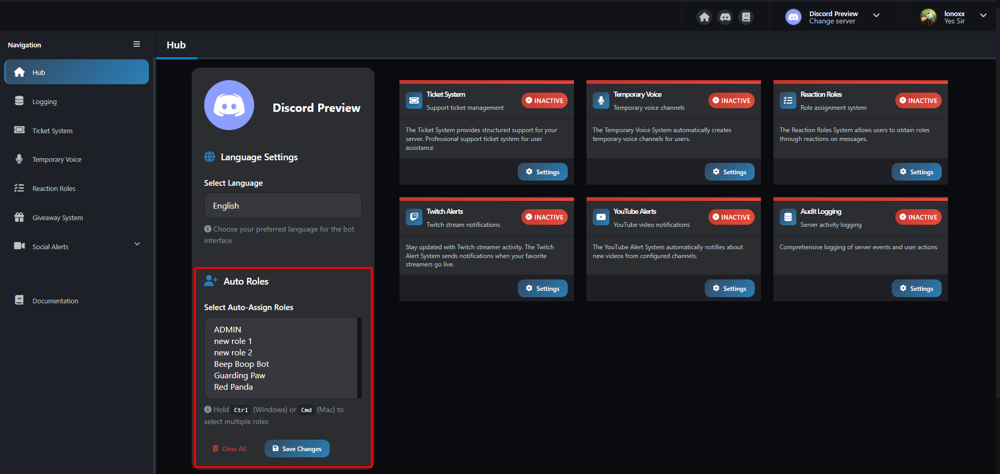

# Auto Role Assignment

Automatically assign roles to new members when they join your Discord server. This feature helps streamline the onboarding process and ensures consistent role distribution.

> [!ATTENTION|label:Important Requirements]
> - The bot must have **Manage Roles** permission
> - The role being assigned must be **below** the bot's highest role in the role hierarchy

## How It Works

When a new member joins your server, Guarding Paw will automatically assign the configured role within seconds. This eliminates the need for manual role assignment and ensures all new members receive the appropriate permissions immediately.

### Setup Steps:

1. **Visit the [Hub](https://guardingpaw.xyz/manage)**:  and select your server
2. **Select Role**: Choose the role you want to automatically assign to new members

