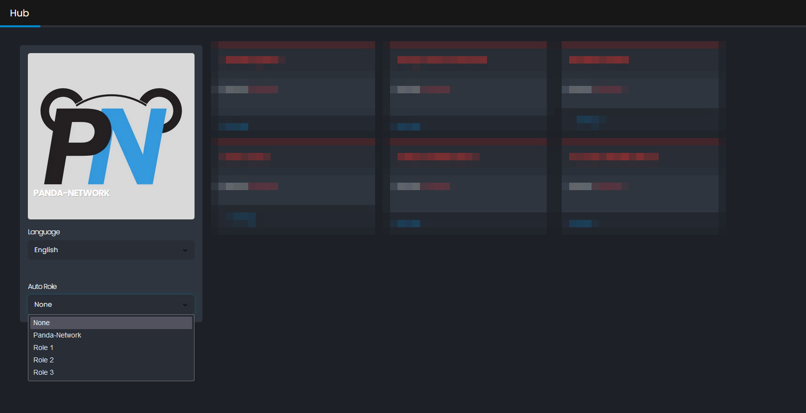

## Autorole

> [!ATTENTION|label:|iconVisibility:hidden]
> Make sure that the bot has permission to manage roles **and** that the role the bot is assigning is below the highest role the bot has.
  
 

Autorole view

<b>Automatically assign members this role:</b>   Select the role that you want to bot to auto assign (only one role can be auto assigned).