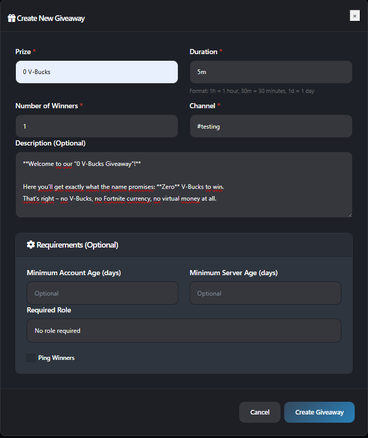
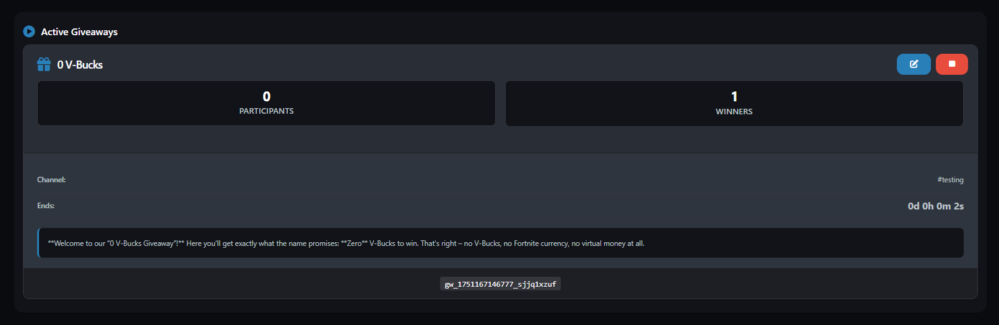
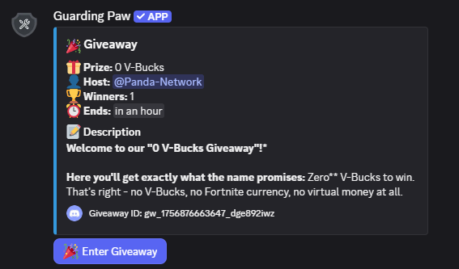
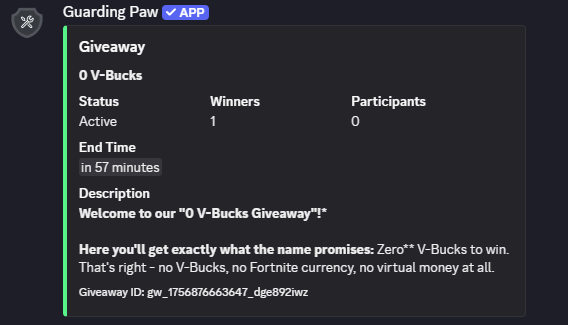

# Giveaway System

Easily create and manage giveaways on your Discord server with Guarding Paw. Automate prize draws, set participation requirements, and keep your community engaged.

> [!ATTENTION|label:Requirements]
> - **Permission Needed:** Manage Events
> - **Cooldown:** 30 seconds between commands

## Commands

| Command                | Description                        | Required Parameters                | Optional Parameters                                                                 |
|------------------------|------------------------------------|-------------------------------------|-------------------------------------------------------------------------------------|
| `/giveaway start`      | Start a new giveaway               | `duration`, `prize`, `winners`      | `channel`, `description`, `accountage`, `serverage`, `requiredrole`, `pingusers`    |
| `/giveaway edit`       | Edit an active giveaway            | `giveawayid`                        | `changeprize`, `description`, `winneramount`, `addtime`, `subtime`                  |
| `/giveaway end`        | End a giveaway immediately         | `giveawayid`                        | -                                                                                   |
| `/giveaway reroll`     | Reroll winners for a giveaway      | `giveawayid`, `howmany`             | -                                                                                   |

**Parameter Details:**
- `duration`: How long the giveaway runs (e.g., `1h`, `30m`, `2d`, `1w`)
- `prize`: The item to win
- `winners`: Number of winners (1-20)
- `channel`: Channel for the giveaway (default: current channel)
- `description`: Extra info for the giveaway
- `accountage`: Minimum account age in days (1-365)
- `serverage`: Minimum server membership in days (1-365)
- `requiredrole`: Role required to participate
- `pingusers`: Whether to ping winners at the end (true/false)

## How It Works

1. **Start a Giveaway:** Use the `/giveaway start` command with your desired parameters.
2. **Participation:** Users join by clicking the 🎉 button. All requirements are checked automatically.
3. **Automatic Draw:** The giveaway ends at the set time, winners are chosen, and the message is updated.
4. **Management:** Edit, end, or reroll giveaways at any time using the provided commands.

---

## Examples

```bash
/giveaway start duration:2h prize:0 V-Bucks winners:1
/giveaway start duration:1d prize:Gaming-Setup winners:3 accountage:30 serverage:7 requiredrole:@Member
/giveaway edit giveawayid:gw_123456789 changeprize:New Prize addtime:1h
/giveaway end giveawayid:gw_123456789
/giveaway reroll giveawayid:gw_123456789 howmany:2
```

---

## Features

- **Automatic winner selection**
- **Customizable requirements** (account/server age, roles)
- **Flexible time formats:** `30s`, `5m`, `2h`, `1d`, `1w`, `1mo`
- **Unlimited concurrent giveaways**
- **Web Dashboard integration** for overview and management

---

## Web Dashboard

Manage all giveaways visually:
- View active and ended giveaways
- End or reroll giveaways
- See statistics

[Open the Guarding Paw Web Dashboard](https://guardingpaw.xyz/manage)

---


## Preview


|  |  |
| -------------------------------------------------------------- | ------------------------------------------------------------------ |
|  |  |
| -------------------------------------------------------------------------- | --------------------------------------------------------------------------- |

---

> **Need Help?** Join our [support server](https://pnnet.dev/discord) for assistance with any commands or features.
