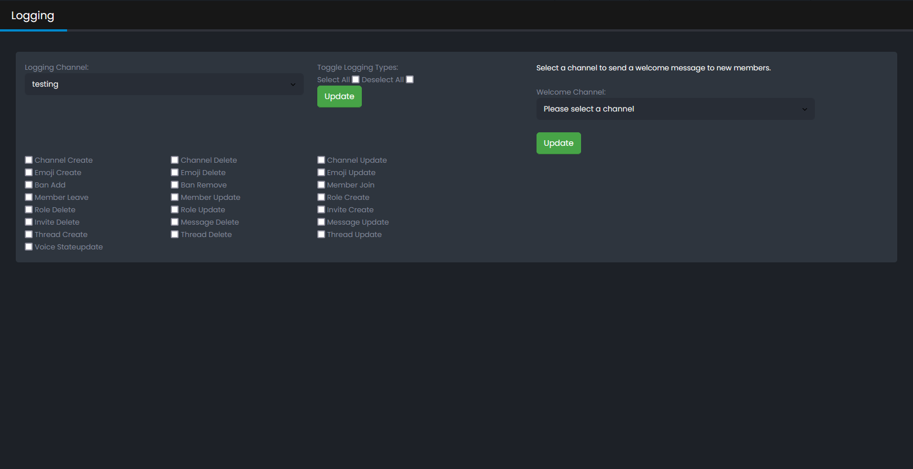
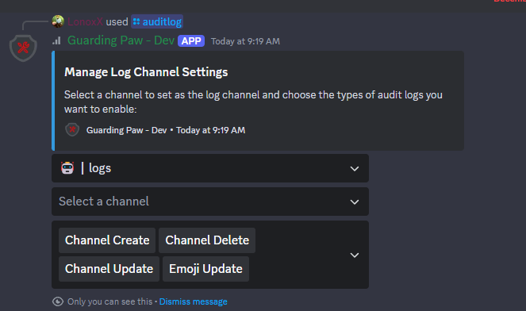

## Logging

You can Log Audit log events zb. when a user joins or leaves a voice channel, or when a user is banned or unbanned from the server.

You can select which events you want to log by chcking the boxes. You can also set a channel where the logs will be sent to.
If you want to send a welcome message to the user when they join the server, you can select a channel where the message will be sent to.

### Setup

### Discord Commands
- `/auditlog` - Select the events you want to log and the channel where the logs will be sent to.

> [!note|label:|iconVisibility:hidden]
> if you have a lot of discord channels you have more then 1 Select channel option.Because of the discord limitation of 25 channels per select menu.

### Preview

