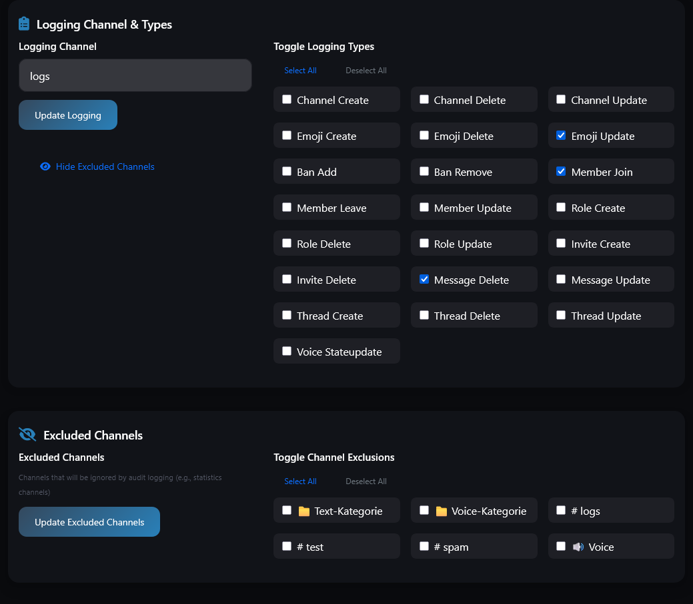
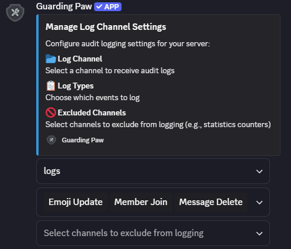
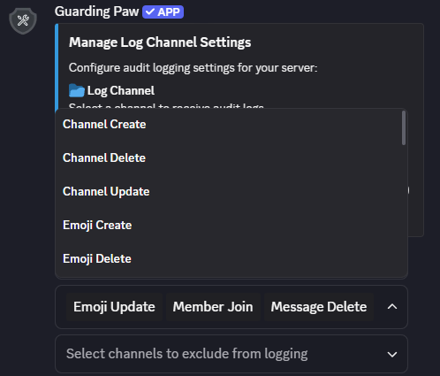
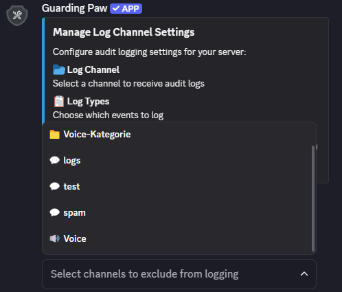

# Server Logging & Audit Events

Monitor and track important server activities with Guarding Paw's comprehensive logging system. Keep your moderation team informed and maintain detailed records of server events.

## Commands

| Command     | Description                           | Required Parameters | Optional Parameters |
|-------------|---------------------------------------|---------------------|--------------------|
| `/auditlog` | Configure logging events and channels | -                   | -                  |

## What Gets Logged?

The audit logging system can track various server events, including:

- **Member Events**: Joins, leaves, kicks, bans, timeouts
- **Voice Activity**: Channel joins, leaves, moves, mute/deafen status
- **Role Changes**: Role assignments and removals
- **Channel Activity**: Message deletions, edits (when possible)
- **Server Changes**: Channel creation/deletion, role modifications
- **Bot Actions**: Automated actions performed by Guarding Paw

### Setup Process:

1. **Access Settings**: Visit the [Hub](https://guardingpaw.xyz/manage) and navigate to the Logging section
2. **Select Events**: Check the boxes for events you want to monitor
3. **Choose Log Channel**: Select where log messages should be sent
4. **Configure Welcome Messages**: Optionally set up welcome messages for new members

> [!NOTE|label:Channel Limitations]
> If your server has many channels, you'll see multiple "Select channel" options due to Discord's 25-option limit per select menu.

## Preview

|   |                                                                        |
| ---------------------------------------------------------------------- | ---------------------------------------------------------------------- |
|  |  |

> **Need Help?** Join our [support server](https://pnnet.dev/discord) for assistance with any commands or features.
