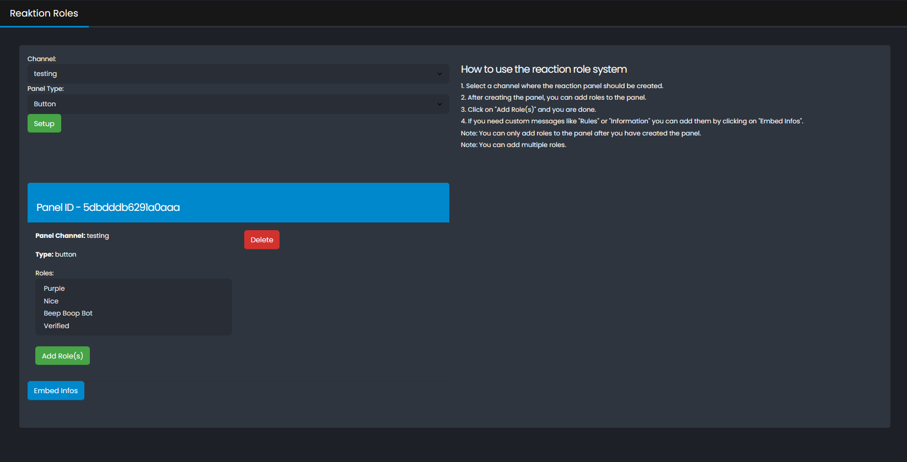
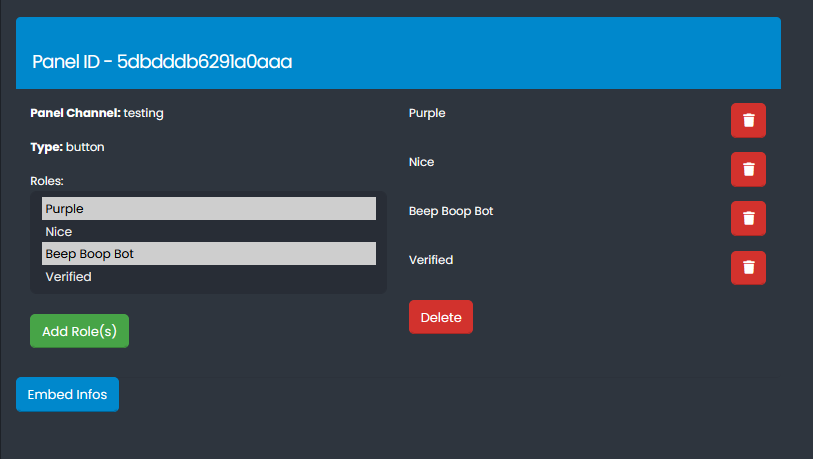
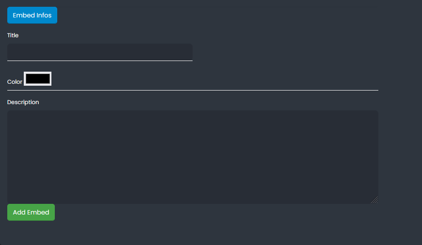

## Reaktion Roles

Select a Channel and Type of the panel you want to create.
You can choose between a select menu or a button. After that, you can add roles to the panel. (Multiple roles press shift and click on the roles you want to add)
If you need custom messages like **Rules** or **Information** you can add them by clicking on "Embed Infos".
Note: You can only add roles to the panel after you have created the panel.
Note: You can add multiple roles. 

### Preview

### Discord Command`s 
- `/reactionrole setup channel: type:<selectmenu / button>` - Setup a new reaction role panel.
- `/reactionrole add role: panelid:` (optional) - `description:Yes Sir emoji: color:`* - Add a new role to the reaction role panel. 
- `/reactionrole list` - List all reaction role panels.
- `/reactionrole edit panelid:` - Edit a reaction role panel. (Embed Title, Description, Color)
- `/reactionrole remove role: panelid:` - Remove a role from the reaction role panel.
- `/reactionrole unistall panelid:` - Delete a reaction role panel.

* Note: 
 Color: `Primary , Secondary , Success ,Danger`