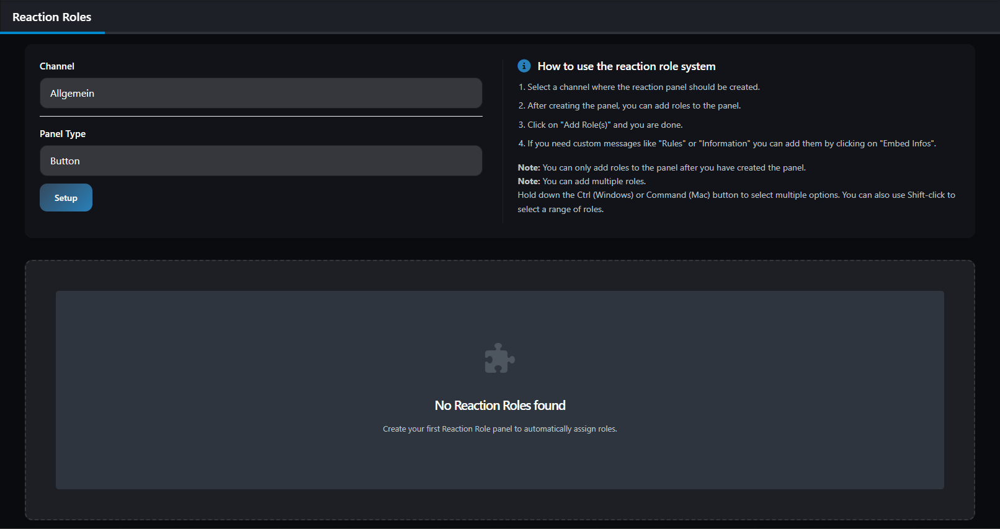
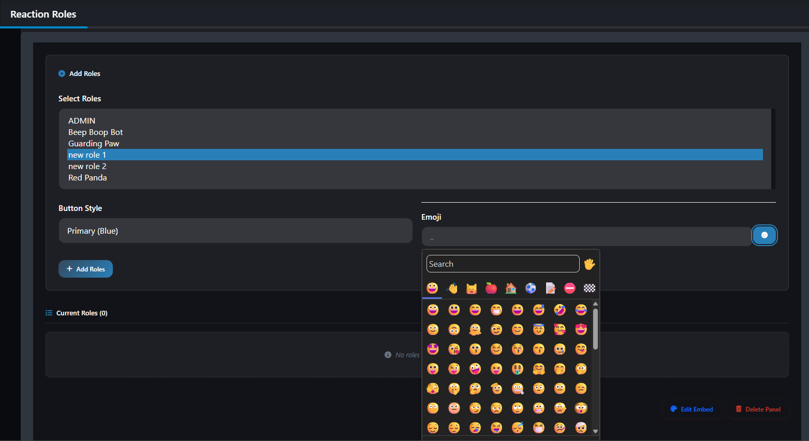
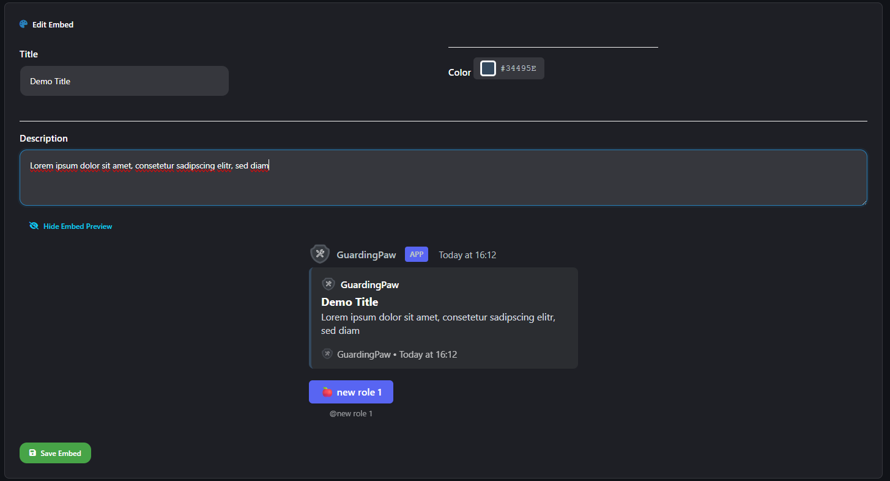
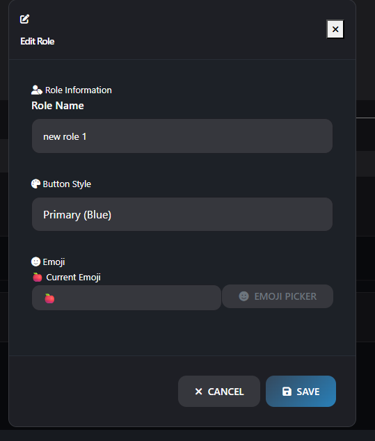
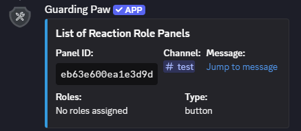
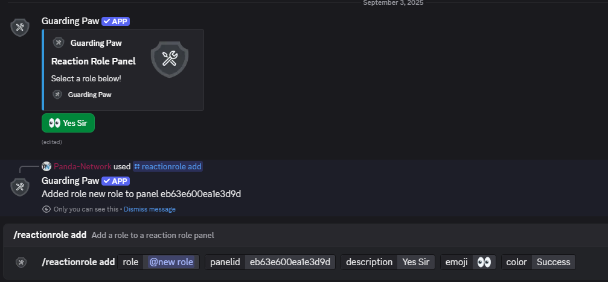
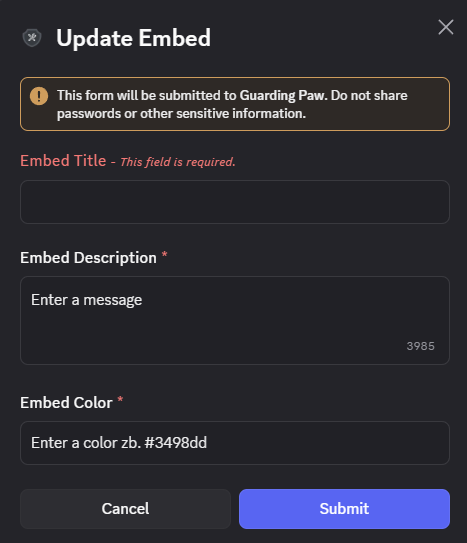

# Reaction Roles

Select a Channel and Type of the panel you want to create. You can choose between a select menu or a button. After that, you can add roles to the panel. (Multiple roles: press shift and click on the roles you want to add)

If you need custom messages like **Rules** or **Information** you can add them by clicking on "Embed Infos".

> [!NOTE]
> - You can only add roles to the panel after you have created the panel
> - You can add multiple roles

## Commands

| Command                   | Description                      | Required Parameters | Optional Parameters             |
| ------------------------- | -------------------------------- | ------------------- | ------------------------------- |
| `/reactionrole setup`     | Create a new reaction role panel | `channel`, `type`   | -                               |
| `/reactionrole add`       | Add a role to an existing panel  | `role`, `panelid`   | `description`, `emoji`, `color` |
| `/reactionrole list`      | List all reaction role panels    | -                   | -                               |
| `/reactionrole edit`      | Update Embed appearance          | `panelid`           | -                               |
| `/reactionrole remove`    | Remove a role from panel         | `role`, `panelid`   | -                               |
| `/reactionrole uninstall` | Delete entire panel              | `panelid`           | -                               |

**Parameter Details:**
- `channel`: The channel for the reaction role panel.
- `type`: Type of panel (`selectmenu` or `button`).
- `role`: The role to add/remove.
- `panelid`: ID of the panel.
- `description`: Description for the role.
- `emoji`: Emoji for the role.
- `color`: Color for the button (Primary, Secondary, Success, Danger).

**Available Colors:** `Primary`, `Secondary`, `Success`, `Danger`

## Preview

|                |  |
| -------------------------------------------------------------------------------------------- | ---------------------------------------------------------------------------------------------- |
|                                   |                                        |
|  |                                                                                                |
|       |                  |

> **Need Help?** Join our [support server](https://pnnet.dev/discord) for assistance with any commands or features.
