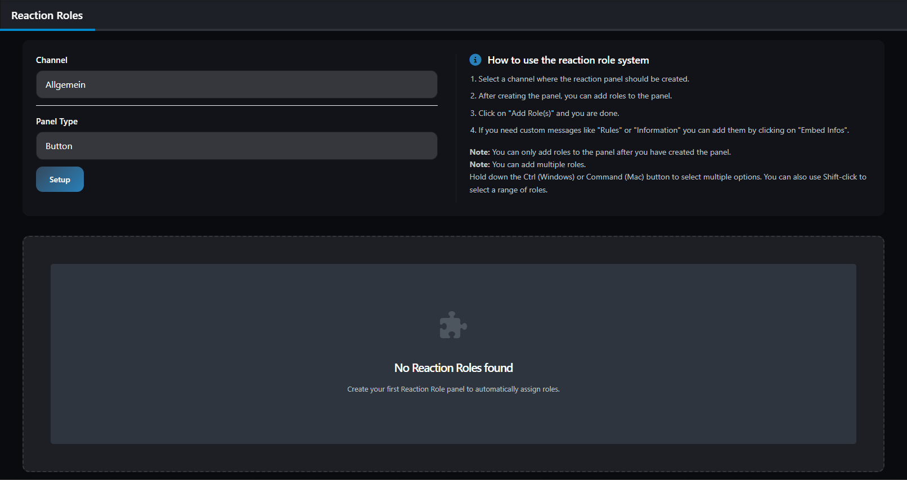
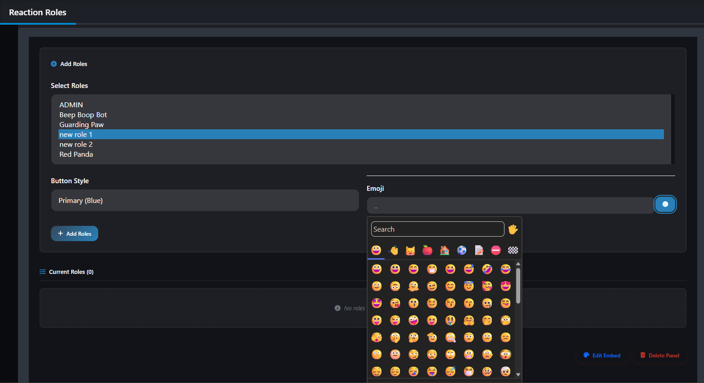
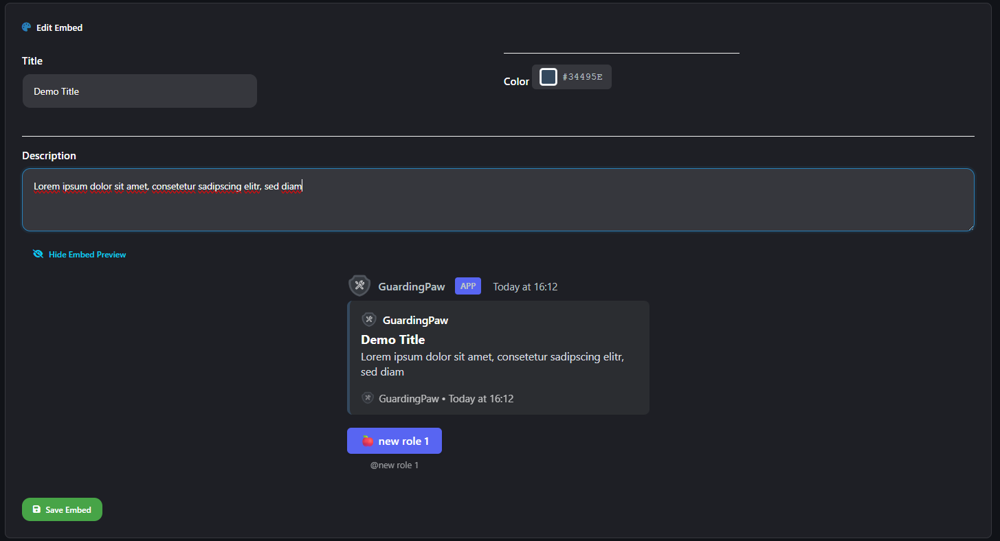
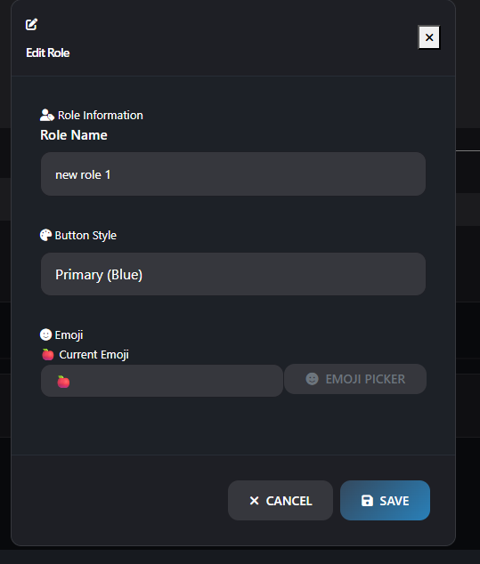

# Reaction Roles

Select a Channel and Type of the panel you want to create. You can choose between a select menu or a button. After that, you can add roles to the panel. (Multiple roles: press shift and click on the roles you want to add)

If you need custom messages like **Rules** or **Information** you can add them by clicking on "Embed Infos".

> [!NOTE]
> - You can only add roles to the panel after you have created the panel
> - You can add multiple roles

## Preview

#### Generell overview

#### Setup a Role

#### Edit Embed & Role

## Discord Commands

- `/reactionrole setup channel: type:<selectmenu / button>` - Setup a new reaction role panel
- `/reactionrole add role: panelid:` (optional) - Add a new role to the reaction role panel
  - Parameters: `description:` `emoji:` `color:`
- `/reactionrole list` - List all reaction role panels
- `/reactionrole edit panelid:` - Edit a reaction role panel (Embed Title, Description, Color)
- `/reactionrole remove role: panelid:` - Remove a role from the reaction role panel
- `/reactionrole uninstall panelid:` - Delete a reaction role panel

### Color Options

Available color options: `Primary`, `Secondary`, `Success`, `Danger`
