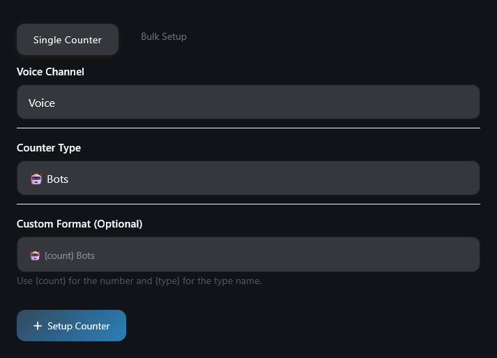
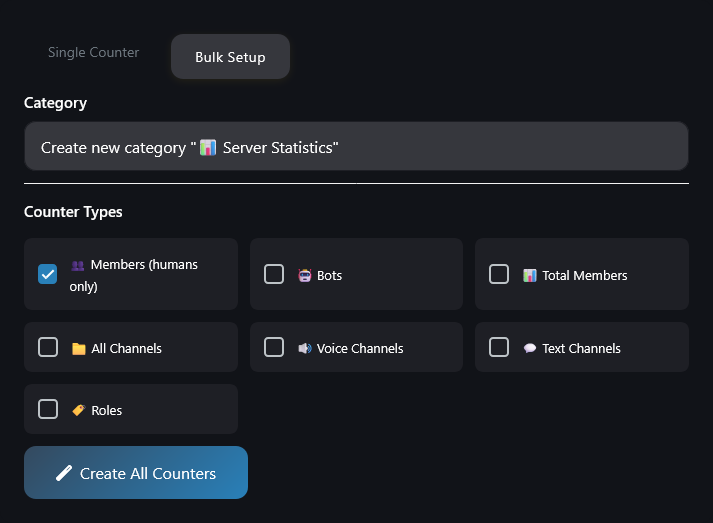
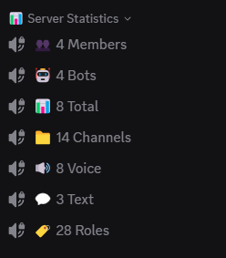

# Server Statistics

Automatically display server statistics in voice channels that update in real-time. Track member counts, channels, roles, and more with customizable formats.

> [!ATTENTION|label:Requirements]
> - **Bot Permission Needed:** Manage Channels
> - **User Permission Needed:** Manage Guild
> - **Cooldown:** 10 seconds between commands

## Commands

| Command                | Description                          | Required Parameters                  | Optional Parameters |
|------------------------|--------------------------------------|--------------------------------------|---------------------|
| `/statistics setup`    | Setup a server statistics counter    | `channel`, `type`                    | `format`            |
| `/statistics bulksetup`| Setup multiple counters automatically| -                                    | `category`          |
| `/statistics list`     | List all server statistics           | -                                    | -                   |
| `/statistics remove`   | Remove a statistics counter          | `channel`                            | -                   |
| `/statistics update`   | Force update all statistics          | -                                    | -                   |

**Parameter Details:**
- `channel`: Voice channel to use as counter
- `type`: Type of counter (`members`, `bots`, `total_members`, `channels`, `voice_channels`, `text_channels`, `roles`)
- `format`: Custom format using `{count}` and `{type}` placeholders (default formats applied if not provided)
- `category`: Category for bulk setup (new category created if not provided)

## How It Works

1. **Setup Counter:** Use `/statistics setup` to configure a voice channel as a statistics counter.
2. **Automatic Updates:** Counters update every 10-20 minutes automatically.
3. **Bulk Setup:** Use `/statistics bulksetup` to create multiple counters at once with a selection menu.
4. **Management:** List, remove, or manually update counters as needed.
5. All Stats Channels will be automatically added to the [Excluded Channels](/sites/logging.md) list.

---

## Examples

```bash
/statistics setup channel:#stats-members type:members format:👥 Members: {count}
/statistics bulksetup category:#Server Stats
/statistics list
/statistics remove channel:#stats-members
/statistics update
```

---

## Features

- **Real-time Updates:** Statistics update automatically every 5 minutes
- **Custom Formats:** Use placeholders for personalized counter names
- **Bulk Setup:** Create multiple counters with one command


|  |  |
| ----------------------------------------------------------------------- | --------------------------------------------------------------- |
|                |                                                                 |


> **Need Help?** Join our [support server](https://pnnet.dev/discord) for assistance with any commands or features.
