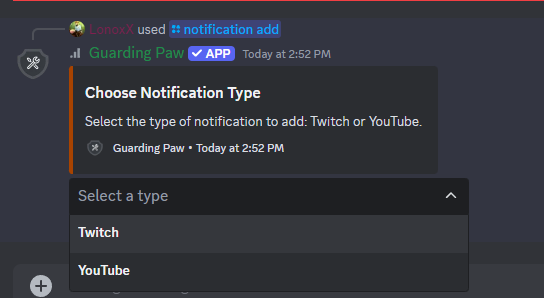
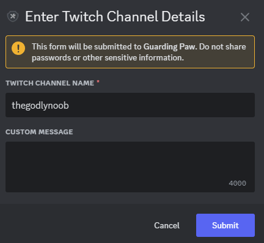
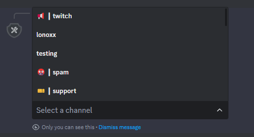
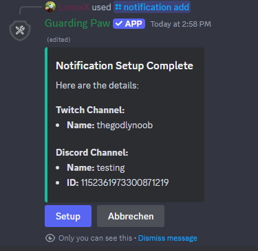
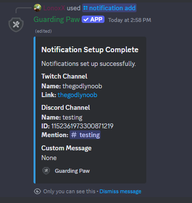
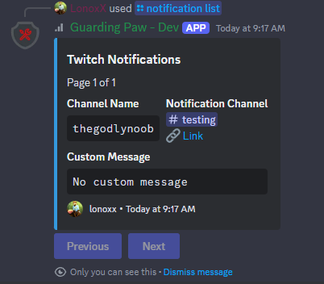
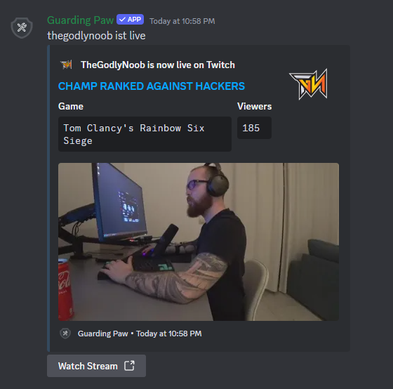

## Twitch Notifications

To receive notifications from a Twitch streamer, simply go to the Twitch channel you want to receive notifications from and copy the name from the URL. `https://www.twitch.tv/`**thegodlynoob** 

The default notification message is:   `<everyone> <channelname> is now live! Go check it out!!` 
You can customize the message by using the following placeholders: 
- `<everyone>` - Mentions everyone
- `<channelname>` - The name of the channel

## Discord Commands

Use the following Discord commands to manage your Twitch notifications:

- `/notification add` - Select the notification type and add a new notification.
- `/notification list type:Twitch` - Get a list of all Twitch notifications.
- `/notification remove removechannel:<channelname>` - Remove a notification for a specific channel.

### Preview

Below are some preview images to help you understand the process:

