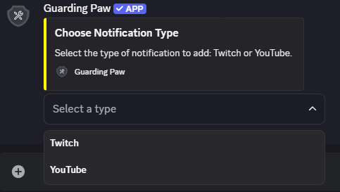
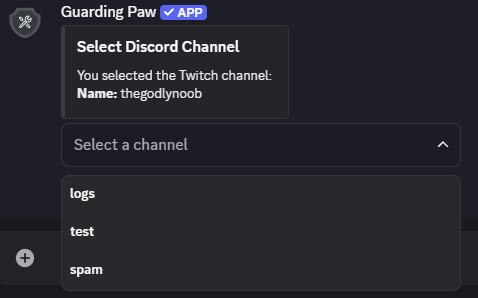
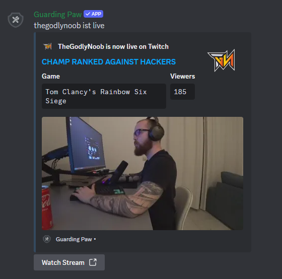

# Twitch Notifications

To receive notifications from a Twitch streamer, simply go to the Twitch channel you want to receive notifications from and copy the name from the URL: `https://www.twitch.tv/`**thegodlynoob**


## Commands

| Command                | Description                | Required Parameters | Optional Parameters |
| ---------------------- | -------------------------- | ------------------- | ------------------- |
| `/Notification add`    | Add a new Notification     | -                   | -                   |
| `/Notification list`   | List notifications by type | `type`              | -                   |
| `/Notification remove` | Remove a Notification      | `removechannel`     | -                   |

**Parameter Details:**
- `type`: Type of Notification (`Twitch` or `YouTube`).
- `removechannel`: Name of the channel to remove.

**Supported Types:** Twitch, YouTube

## Message Customization

The default Notification message is:
```
<everyone> <channelname> is now live! Go check it out!!
```

You can customize the message by using the following placeholders:
- `<everyone>` - Mentions everyone
- `<channelname>` - The name of the channel

## Preview

Below are some preview images to help you understand the process:


|  |  |
| ------------------------------------------------------------------------------------------ | ------------------------------------------------------------------------------------------- |
|                                                                                            |                                                                                             |


|    |      |
| ----------------------------------------------------------------------------------------------- | -------------------------------------------------------------------------------------------------- |
|        |          |
|  |  |
|                                                                                                 |                                                                                                    |


> **Need Help?** Join our [support server](https://pnnet.dev/discord) for assistance with any commands or features.
