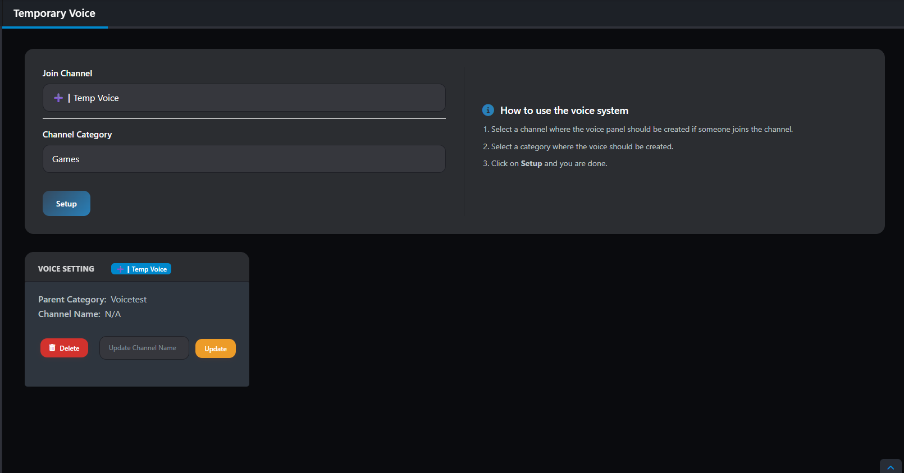
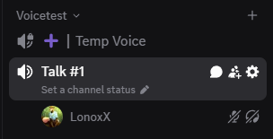
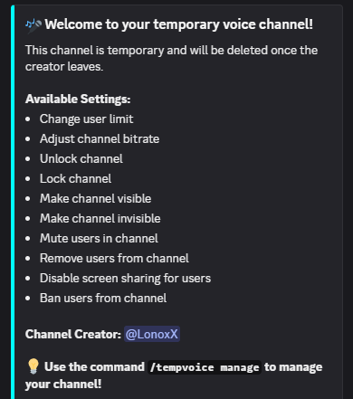

# Temporary Voice Channels

Create dynamic voice channels that automatically appear when needed and disappear when empty. Perfect for communities that need flexible voice communication without cluttering the server with unused channels.

## How It Works

Temporary voice channels provide an elegant solution to voice channel management:

1. **Join the Master Channel**: Users join a designated "create channel"
2. **Automatic Creation**: A new temporary voice channel is instantly created
3. **User Gets Moved**: The user is automatically moved to their new channel
4. **Channel Ownership**: The creator gets manage permissions for their channel
5. **Auto Cleanup**: When the last user leaves, the channel is automatically deleted

**Default Channel Name Pattern**: `Talk #<ID>` (where ID is a unique number)

## Setup & Configuration

### Hub Setup:
1. Visit the [Hub](https://guardingpaw.xyz/manage)
2. Navigate to "Temporary Voice Channels"
3. Configure your master channel and category
4. Optionally customize the channel name pattern

### Discord Command Setup:
```
/voice setup masterchannel:#"➕┃Temp Voice" category:#"Voice Channels"
```

**Optional Parameters:**
- `channel:` - Custom name pattern (e.g., `channel:My Room #` results in "My Room #1", "My Room #2", etc.)

## Preview

### Creation Process:

### Result:



## Channel Management

As the creator of a temporary voice channel, you have full control over your channel and can manage various settings:

**Available Settings:**
- Change user limit
- Adjust channel bitrate
- Unlock channel
- Lock channel
- Make channel visible
- Make channel invisible
- Mute users in channel
- Remove users from channel
- Disable screen sharing for users
- Ban users from channel

💡 **Use the command `/tempvoice manage` to manage your channel!**

## Management Commands

| Command         | Description                         | Example                                              |
| --------------- | ----------------------------------- | ---------------------------------------------------- |
| `/voice setup`  | Configure temporary voice system    | `/voice setup masterchannel:#create category:#voice` |
| `/voice list`   | Show all active temporary channels  | `/voice list`                                        |
| `/voice remove` | Manually delete a temporary channel | `/voice remove voiceid:123456789`                    |
| `/voice manage` | Manage your temporary voice channel | `/tempvoice manage action:Set User Limit value:1`|

> [!NOTE|label:Channel Limitations]
> also you can use use: xxx to user the user based actions
