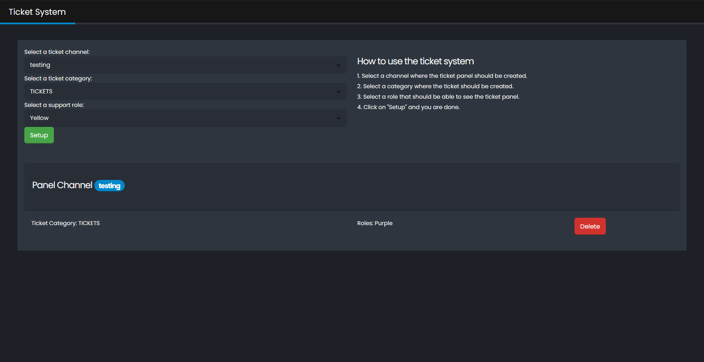

## Ticket System

Support ticket system for efficient user and staff communication.

### Preview

after closing a ticket will be created automatically a [Transcript](transcript.md) and send it to the [Logchannel](logging.md) and the user who created the ticket.

### Discord Command`s
- `/ticket setup channel:  category: role:` - Setup a new Ticket Panel.
- `/ticket list ` - List all Ticket Panels.
- `/ticket remove panel:` - Remove a Ticket Panel.
- `/ticket adduser user:` - Add a user to the ticket.
- `/ticket removeuser user:` - Remove a user from the ticket.
