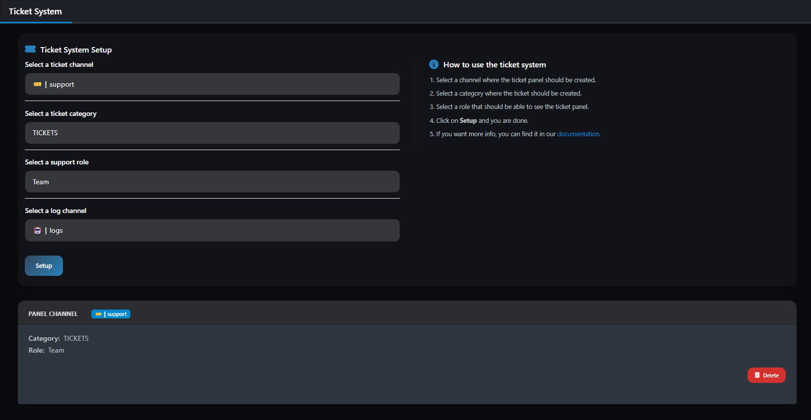

# Ticket System

Support ticket system for efficient user and staff communication.

## Commands

| Command            | Description              | Required Parameters     | Optional Parameters |
|--------------------|--------------------------|-------------------------|--------------------|
| `/ticket setup`    | Create a new ticket panel| `channel`, `category`, `role` | -                  |
| `/ticket list`     | List all ticket panels   | -                       | -                  |
| `/ticket remove`   | Remove a ticket panel    | `panel`                 | -                  |
| `/ticket adduser`  | Add a user to the ticket | `user`                  | -                  |
| `/ticket removeuser`| Remove a user from the ticket | `user`              | -                  |

**Parameter Details:**
- `channel`: The channel for the ticket panel.
- `category`: The category for tickets.
- `role`: The staff role.
- `panel`: ID of the panel to remove.
- `user`: The user to add/remove.

## Preview

After closing a ticket, a [Transcript](transcript.md) will be created automatically and sent to the selectet Log channel and the user who created the ticket.
