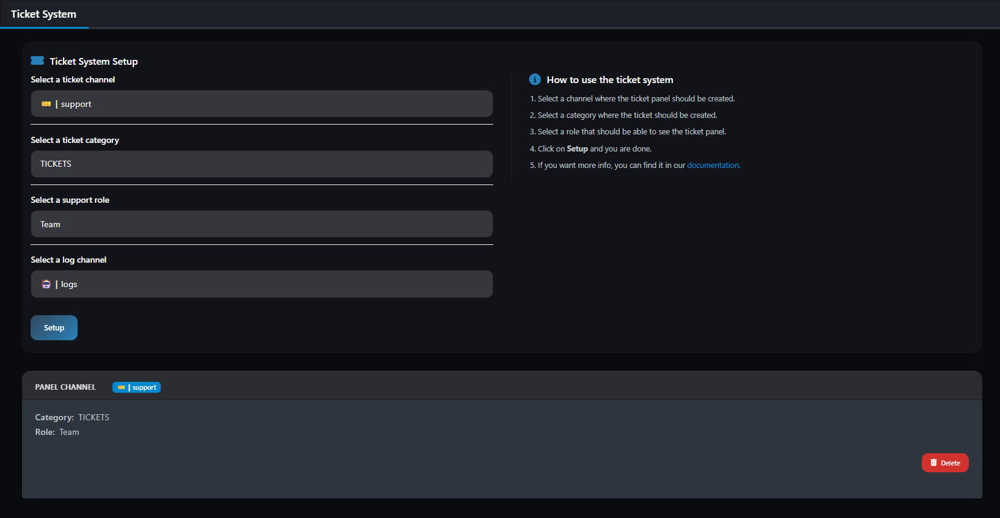

# Ticket System

Support ticket system for efficient user and staff communication.

## Preview

After closing a ticket, a [Transcript](transcript.md) will be created automatically and sent to the selectet Log channel and the user who created the ticket.

## Discord Commands

- `/ticket setup channel: category: role:` - Setup a new Ticket Panel
- `/ticket list` - List all Ticket Panels
- `/ticket remove panel:` - Remove a Ticket Panel
- `/ticket adduser user:` - Add a user to the ticket
- `/ticket removeuser user:` - Remove a user from the ticket
