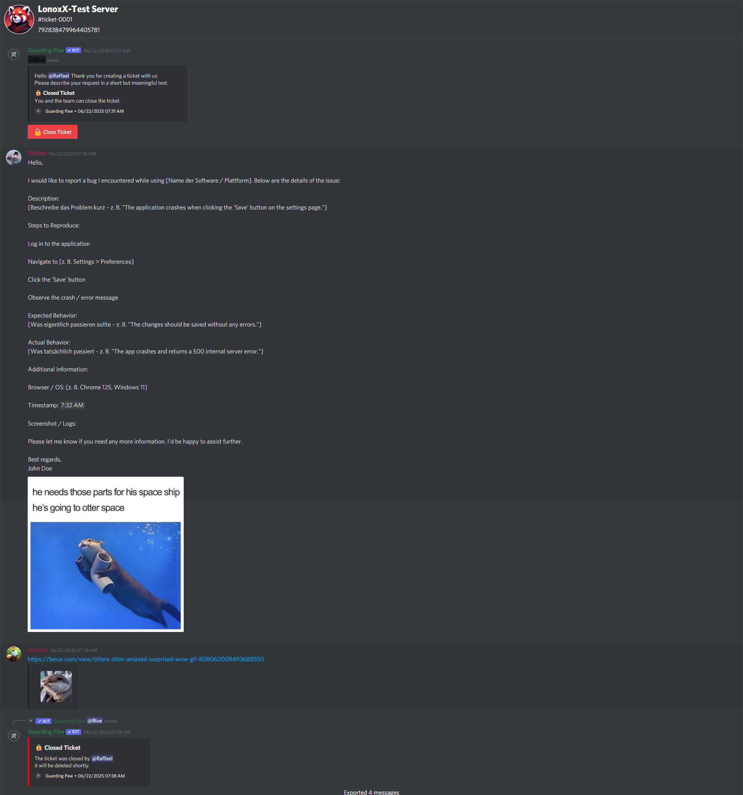

# Ticket Transcripts

When a support ticket is closed, Guarding Paw automatically generates a comprehensive transcript of the entire conversation. This feature ensures that important information is preserved and accessible for future reference.

## What is a Transcript?

A transcript is a complete record of all messages, interactions, and events that occurred within a support ticket. It includes:

- **All messages** sent by users and staff members
- **Timestamps** for each message
- **User information** (usernames, Avatar)
- **Attachments** and media shared during the conversation

## Preview
[Example Transcript](https://guardingpaw.xyz/transcript/834b-edcd-9dba-5bc6-f9ab-a913-a6b6-1f29/830008536623874088)

## Automatic Generation

Transcripts are generated automatically when:
- A ticket is closed by staff or the user

When a transcript is generated, it is sent to:

1. **The User**: The person who originally created the ticket receives a copy
2. **Log Channel**: If configured, transcripts are posted to your designated [Ticket System](Dokumentation/Dev-Docs/docs/sites/ticket-system.md)

## Configuration

Transcript functionality is automatically enabled when you set up the [Ticket System](Dokumentation/Dev-Docs/docs/sites/ticket-system.md). No additional configuration is required.
