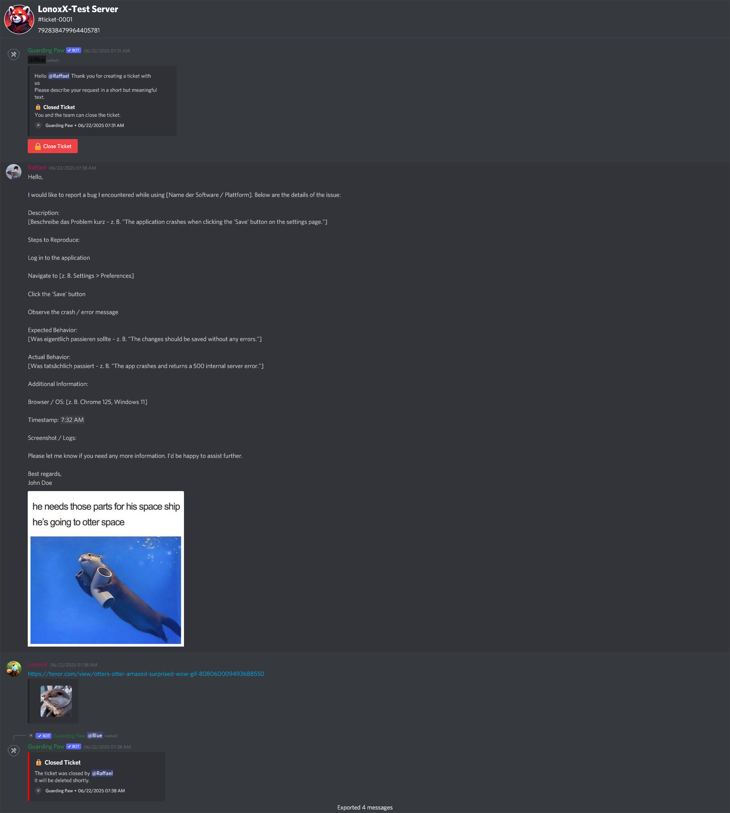

# Ticket Transcripts

When a support ticket is closed, Guarding Paw automatically generates a comprehensive transcript of the entire conversation. This feature ensures that important information is preserved and accessible for future reference.

## Commands

This feature operates automatically upon ticket closure. No Discord commands are available for manual transcript generation.

## What is a Transcript?

A transcript is a complete record of all messages, interactions, and events that occurred within a support ticket. It includes:

- **All messages** sent by users and staff members
- **Timestamps** for each message
- **User information** (usernames, Avatar)
- **Attachments** and media shared during the conversation

## Automatic Generation

Transcripts are generated automatically when:
- A ticket is closed by staff or the user

When a transcript is generated, it is sent to:

1. **The User**: The person who originally created the ticket receives a copy
2. **Log Channel**: If configured, transcripts are posted to your designated [Ticket System](ticket-system.md)

## Configuration

Transcript functionality is automatically enabled when you set up the [Ticket System](ticket-system.md). No additional configuration is required.

## Preview

> **Need Help?** Join our [support server](https://pnnet.dev/discord) for assistance with any commands or features.
