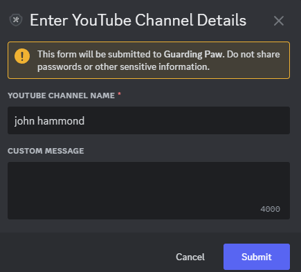
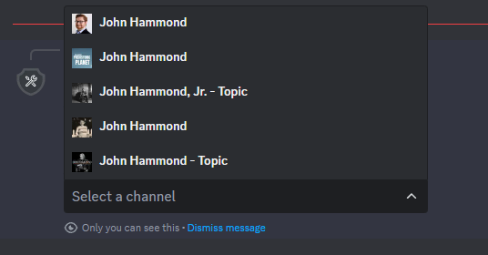
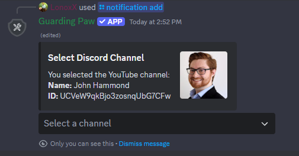
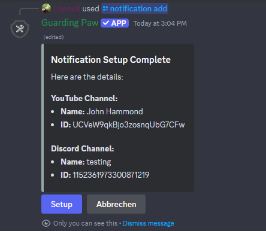
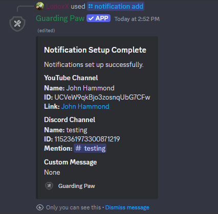
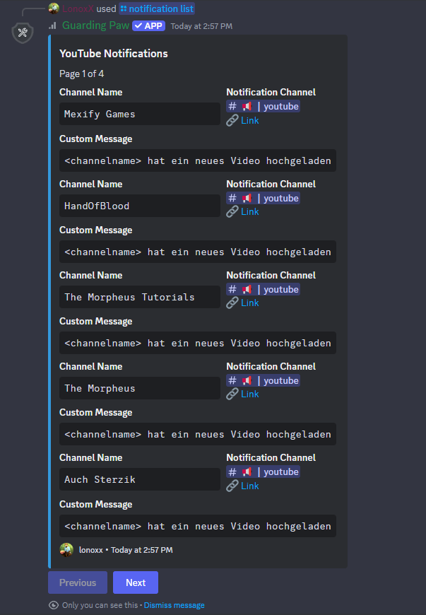

# YouTube Notifications

To start, you can either **enter the YouTube Channel ID directly** or **search for the channel by name**. The system will search YouTube and show a list of matching channels. Simply select the correct channel from the results.

After that, choose the **Discord channel** where you want the notifications to appear, and optionally add a **custom notification message**.

You can also select the specific **Content Type** you want to get notified about – choose between **Videos**, **Shorts**, **Livestreams**, or any combination of them.


## Message Customization

The default notification message is:
```
<everyone> <channelname> uploaded a new video! Go check it out!!
```

You can customize the message by using the following placeholders:
- `<everyone>` - Mentions everyone in the Discord channel
- `<channelname>` - The name of the YouTube channel

## Discord Commands

Use the following Discord commands to manage your YouTube notifications:

- `/notification add` - Select the notification type and add a new notification
- `/notification list type:YouTube` - Get a list of all YouTube notifications
- `/notification remove removechannel:<channelname>` - Remove a notification for a specific channel

### Preview

Below are some preview images to help you understand the process:











