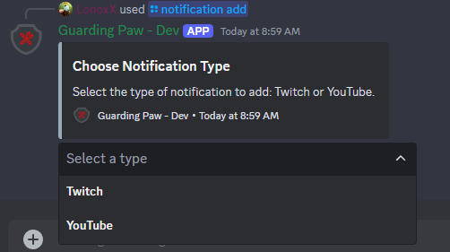
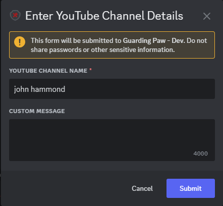
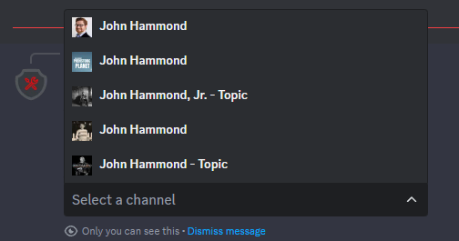
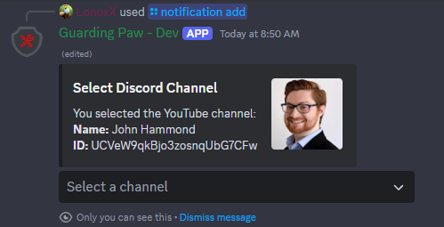
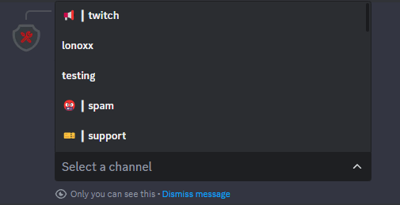
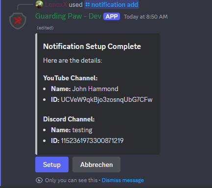
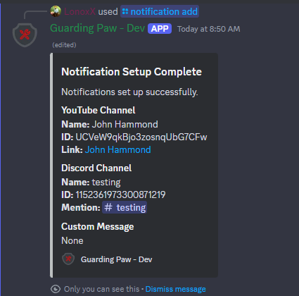
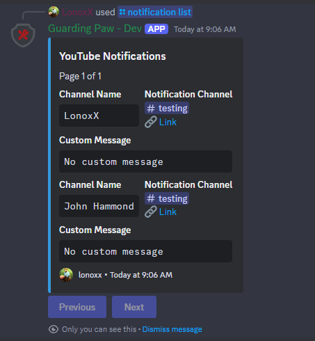

## YouTube Notifications

To receive notifications from a YouTube channel, simply enter the channel name in the provided field. The system will search for matches and display a list of channels. Select the appropriate channel from the list. After that, you can choose the Discord channel where you want to receive the notifications and specify a custom message for the notifications.

The default notification message is:   `<everyone> <channelname> uploaded a new video! Go check it out!!` 
You can customize the message by using the following placeholders: 
- `<everyone>` - Mentions everyone in the Discord channel
- `<channelname>` - The name of the YouTube channel

## Discord Commands

Use the following Discord commands to manage your YouTube notifications:

- `/notification add` - Select the notification type and add a new notification.
- `/notification list type:YouTube` - Get a list of all YouTube notifications.
- `/notification remove removechannel:<channelname>` - Remove a notification for a specific channel.

### Preview

Below are some preview images to help you understand the process:

