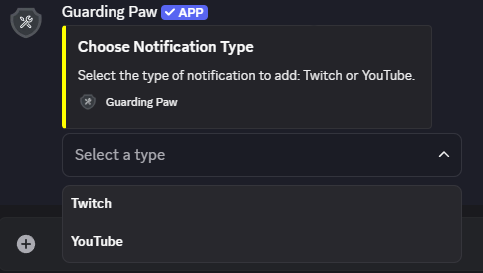
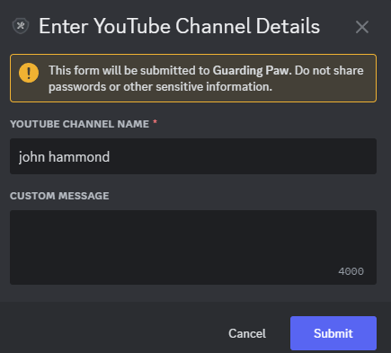
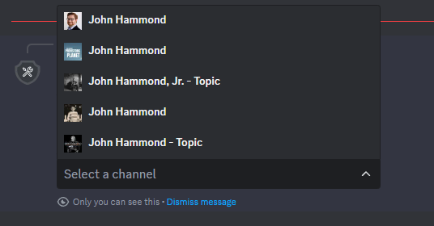
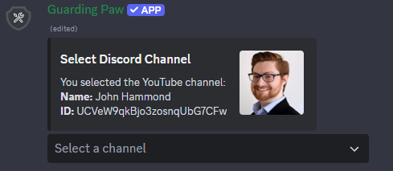
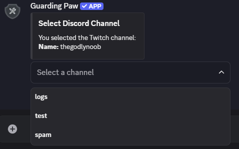
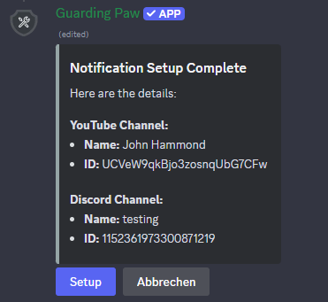
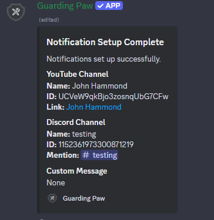
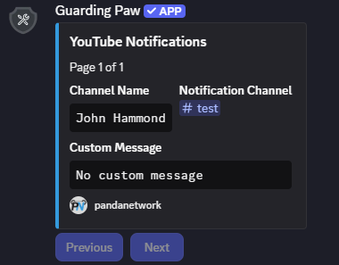
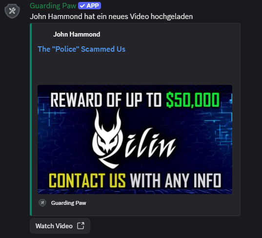

# YouTube Notifications

To start, you can either **enter the YouTube Channel ID directly** or **search for the channel by name**. The system will search YouTube and show a list of matching channels. Simply select the correct channel from the results.

After that, choose the **Discord channel** where you want the notifications to appear, and optionally add a **custom notification message**.

You can also select the specific **Content Type** you want to get notified about – choose between **Videos**, **Shorts**, **Livestreams**, or any combination of them.


## Commands

| Command                | Description                  | Required Parameters | Optional Parameters |
|------------------------|------------------------------|---------------------|--------------------|
| `/notification add`    | Add a new notification       | -                   | -                  |
| `/notification list`   | List notifications by type   | `type`              | -                  |
| `/notification remove` | Remove a notification        | `removechannel`     | -                  |

**Parameter Details:**
- `type`: Type of notification (`Twitch` or `YouTube`).
- `removechannel`: Name of the channel to remove.

**Supported Types:** Twitch, YouTube

## Message Customization

The default notification message is:
```
<everyone> <channelname> uploaded a new video! Go check it out!!
```

You can customize the message by using the following placeholders:
- `<everyone>` - Mentions everyone in the Discord channel
- `<channelname>` - The name of the YouTube channel

## Preview

Below are some preview images to help you understand the process:#


|            |      |
| ------------------------------------------------------------------------------------------------------- | --------------------------------------------------------------------------------------------------- |
|  |  |
|                |  |
|             |    |
|     |                                                                                                     |


> **Need Help?** Join our [support server](https://pnnet.dev/discord) for assistance with any commands or features.
