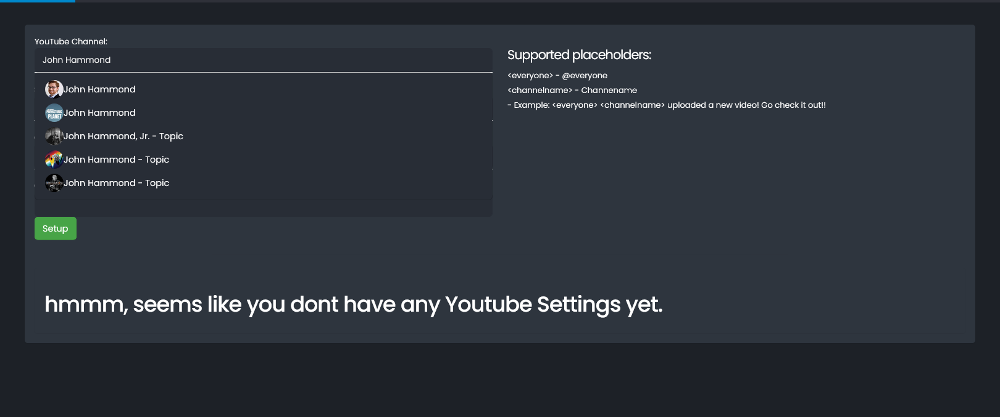
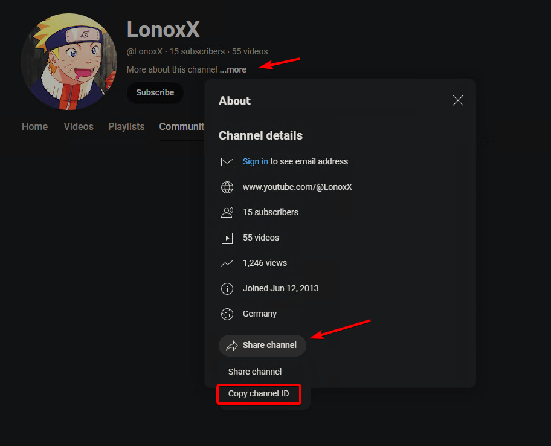
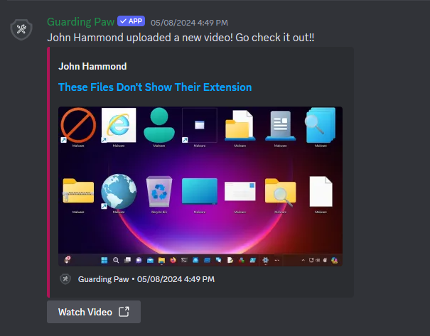

## YouTube Notifications

To receive notifications from a YouTube channel, simply go to the YouTube channel you want to receive notifications from and copy the ChannelID. 

The Default notification message is:   `<everyone> <channelname> uploaded a new video! Go check it out!!` 
You can customize the message by using the following placeholders: 
- `<everyone>` - Mentions everyone
- `<channelname>` - The name of the channel

### How to get the ChannelID

### Preview

## Discord Command´s

`/notification add channel:#testing channelname:<channelname> type:YouTube`  (optional add: `custommessage:<channelname> uploaded a new video! Go check it out!! `) to set a custom message.  
`/notification list type:YouTube` - get a list of all notifications. 
`/notification remove removechannel:<channelname>` - to remove a notification. 
